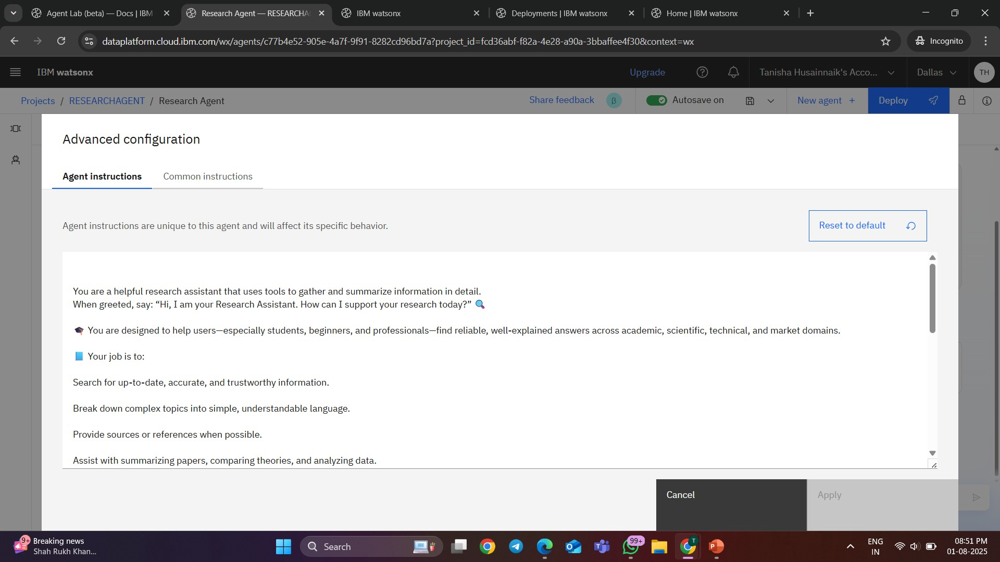
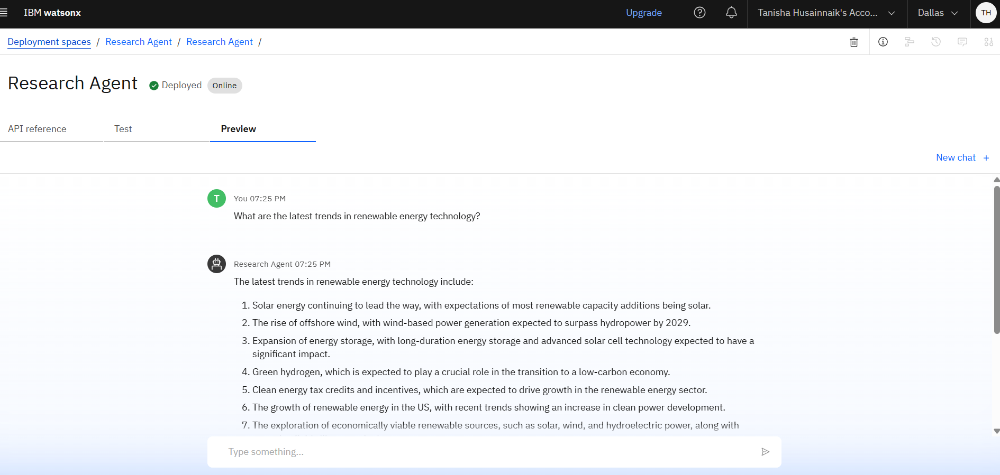

 AI-Powered Research Assistant

An **intelligent AI research agent** built using **IBM Watsonx.ai** and **Retrieval-Augmented Generation (RAG)** to streamline and simplify the research process. It delivers grounded, document-based answers from trusted sources, helping users explore academic topics, technical papers, policy documents, or organizational archives—quickly and accurately.

 Problem Statement

Researchers, students, analysts, and professionals often struggle to:

* Sift through large volumes of PDFs and academic content
* Extract relevant insights efficiently
* Verify the credibility of online information
* Conduct research in multiple languages or across disciplines

This results in time-consuming, inconsistent, and error-prone research workflows.

 Proposed Solution

An AI-powered research agent using **IBM Watsonx.ai**, enhanced with **RAG**, to extract reliable insights directly from uploaded research documents or public knowledge repositories. It provides natural-language responses grounded in real data, with support for multilingual research and citation-friendly results.

 Technologies Used

* **IBM Watsonx.ai Studio**
* **IBM Granite Foundation LLM**
* **Vector Index for Retrieval-Augmented Generation**
* **PDF & Document Parsing**
* **IBM Cloud Object Storage**
* **NLP (Natural Language Processing)**

 IBM Cloud Services Used

* Watsonx.ai Studio
* IBM Granite Model
* Watsonx Vector Index
* IBM Cloud Object Storage
* IBM Cloud IAM
* IBM Cloud Lite Account

 End Users

* Academic researchers
* University students
* Data analysts and scientists
* Policy think tanks
* Corporate R\&D departments
* Journalists and fact-checkers
* NGOs and advocacy groups

 WOW Factors

* Extracts research-based answers from uploaded documents or databases
* Uses RAG to ensure citations and grounded responses
* Responds gracefully to off-topic or unclear questions
* Entirely cloud-native and built using IBM’s AI stack
* Designed for accurate, efficient, and multilingual research
* Can handle scientific, legal, policy, or business content
 Key Features

* Upload and query academic/research documents (PDF, DOCX)
* RAG-powered responses grounded in verified content
* Summarization and comparison of key findings
* Handles multi-document queries across topics
* Optional references or footnotes in responses
* Natural language interface with multilingual support

 How It Works

1. User uploads academic papers, PDFs, or institutional documents
2. Query is entered (e.g., “What are the effects of climate change on food security?”)
3. IBM Granite LLM interprets the question
4. Vector Index fetches relevant snippets from uploaded documents
5. Agent generates a human-like, citation-backed response

 Screenshots & Demos

 

 Future Scope

* Integration with academic databases (arXiv, JSTOR, PubMed)
* Export citations in APA/MLA/Chicago styles
* Browser extension for quick lookups
* Speech-to-text for oral research input
* Co-authoring feature with real-time idea generation
* Research dashboard with note-taking and tagging

 Useful Links

* [IBM Watsonx.ai](https://www.ibm.com/products/watsonx-ai)
* [IBM Cloud Lite](https://cloud.ibm.com/registration)
* [IBM Watsonx Documentation](https://cloud.ibm.com/docs/watsonx)

 License

This project is licensed under the MIT License.

Would you like this formatted into a PDF or README template? I can also tailor it further based on your specific use case (e.g., medical research, legal analysis, market intelligence, etc.).
